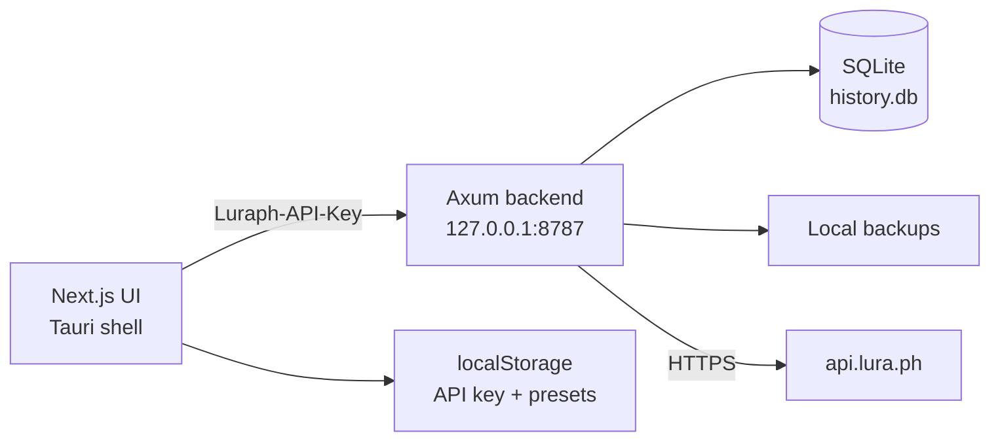

# Luraph API Visual

Native desktop app for the [Luraph obfuscation API](https://lura.ph/dashboard/documents/apidoc). Submit jobs, track status, and keep local copies of results after Luraph’s 24-hour download window expires.

**Windows** and **macOS**. Packaged with Tauri 2.

## Features

- Sign in with a Luraph API key and talk to `api.lura.ph` through a local proxy
- Browse available nodes and submit obfuscation jobs from the dashboard
- Save named **option presets per node** (options, `useTokens`, `enforceSettings`) and reuse them on later jobs
- Manage presets on the Config page: create, edit, duplicate, delete, and mark a default for each node
- Persist job history in SQLite, scoped by a hash of the API key — keys themselves are never stored in the database
- Download finished scripts; the backend writes a local backup so results remain available after remote expiry
- Auto-follow queued and running jobs from the History view
- Run as a native app (recommended) or as a browser UI plus standalone backend

## App pages

| Route | Purpose |
|-------|---------|
| `/` | Sign in with a Luraph API key |
| `/dashboard` | Node list, option inspection, create jobs |
| `/history` | Job history, status follow-up, local downloads |
| `/config` | Node option presets (create / edit / default / duplicate / delete) |
| `/settings` | API key, backend URL, connection check |

When you create a job, pick a saved preset by **name**. If a node has a default preset, the dialog applies it automatically.

## Architecture



| Path | Role |
|------|------|
| `frontend/` | Next.js 16 UI and Tauri 2 desktop shell |
| `backend/` | Rust (Axum) proxy, SQLite history, and file backups |

In the desktop app the backend is **embedded**. It listens on `127.0.0.1:8787` and stores data in the OS application data directory. The standalone `cargo run` binary uses `backend/data/` instead.

## Requirements

- [Node.js](https://nodejs.org/) 20+
- [Rust](https://rustup.rs/) 1.77+ (stable)
- Platform toolchain for Tauri:
  - **Windows:** Microsoft C++ Build Tools, WebView2
  - **macOS:** Xcode Command Line Tools

See the [Tauri 2 prerequisites](https://v2.tauri.app/start/prerequisites/).

## Quick start

### Desktop app (recommended)

```bash
cd frontend
npm install
npm run app:dev
```

This opens a native window titled **Luraph Console**, starts Next.js, and boots the embedded backend.

Sign in with your Luraph API key. History and backups then live under the app data directory:

| OS | Typical location |
|----|------------------|
| Windows | `%APPDATA%\com.luraph.console\` |
| macOS | `~/Library/Application Support/com.luraph.console/` |

Option presets stay in the webview `localStorage` on this device.

### Browser

Use this when you want to debug the UI in a browser.

```bash
# Terminal 1 — API
cd backend
cargo run

# Terminal 2 — web UI
cd frontend
npm install
npm run dev
```

Backend defaults to `http://127.0.0.1:8787` with `data/history.db` and `data/backups/`.

Copy `backend/.env.example` to `backend/.env` if you need to change bind address, database path, or CORS origins.

## Production build

```bash
cd frontend
npm run app:build
```

Tauri writes platform installers under `frontend/src-tauri/target/release/bundle/`.

## Configuration

### Backend environment

| Variable | Default | Description |
|----------|---------|-------------|
| `HOST` | `127.0.0.1` | Bind address |
| `PORT` | `8787` | Listen port |
| `LURAPH_API_BASE` | `https://api.lura.ph/v1` | Upstream API |
| `DATABASE_PATH` | `data/history.db` | SQLite file (standalone) |
| `BACKUP_DIR` | `data/backups` | Obfuscated file backups (standalone) |
| `CORS_ORIGINS` | localhost + Tauri origins | Comma-separated allow list |

The desktop app overrides `DATABASE_PATH` and `BACKUP_DIR` with the OS app data directory. `PORT` can still be overridden via the environment.

### Frontend

| Variable | Default | Description |
|----------|---------|-------------|
| `NEXT_PUBLIC_API_BASE` | `http://127.0.0.1:8787` | Backend origin |

The Settings page can also persist a custom API base in `localStorage`.

### Node option presets

Presets are stored locally under the `luraph-node-configs` key (not in SQLite). Each preset belongs to one node and stores:

- Display **name**
- Option values for that node’s schema
- `useTokens` / `enforceSettings`
- Optional **default** flag for that node

Applying a preset merges saved values onto the live node schema: unknown keys are dropped, missing keys take node defaults. Create and manage them on `/config`, or save quickly from the create-job dialog.

## Project layout

```
.
├── backend/                 # Axum crate (library + standalone binary)
│   ├── src/
│   │   ├── routes/          # /health, /api/v1/nodes, /api/v1/jobs
│   │   ├── luraph.rs        # Upstream HTTP client
│   │   ├── db.rs            # SQLite schema and queries
│   │   └── backup.rs        # Local result files
│   └── .env.example
└── frontend/                # Next.js + Tauri
    ├── app/                 # Sign-in, dashboard, history, config, settings
    ├── components/console/  # Console pages and create-job dialog
    ├── lib/                 # API client, job follow-up, node presets
    └── src-tauri/           # Desktop shell; embeds the backend crate
```
